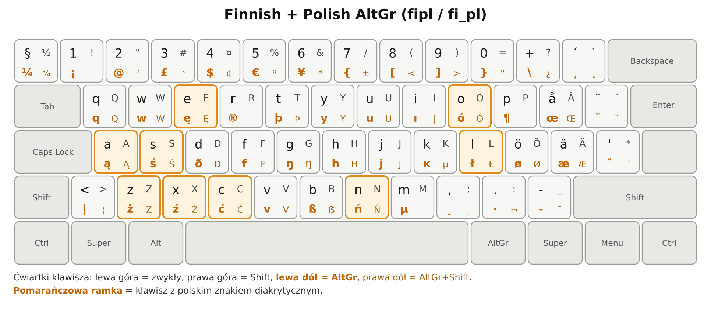
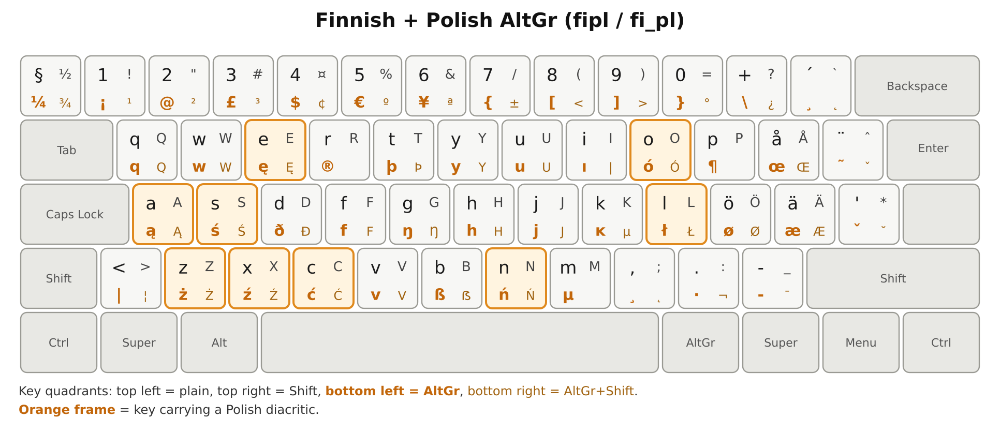
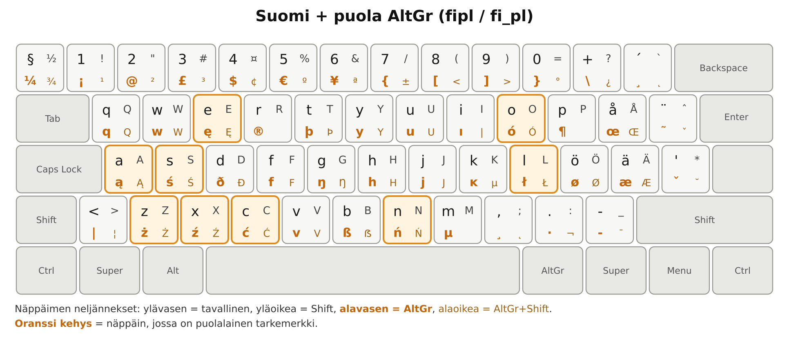

# xkb-fi-pl — Finnish layout with Polish AltGr



**Standardowy fiński układ klawiatury, w którym AltGr daje polskie znaki
dokładnie tak samo jak na polskiej klawiaturze (`pl`).** Fińska podstawa
zostaje nietknięta: `å`, `ö`, `ä`, martwe znaki, wszystko na swoim miejscu.
Dochodzi wyłącznie dziewięć polskich liter na trzecim poziomie.

Nazwa układu: **`fipl`**, wariant **`fi_pl`**.

| klawisz | AltGr | AltGr+Shift |
|---|---|---|
| `a` | ą | Ą |
| `c` | ć | Ć |
| `e` | ę | Ę |
| `l` | ł | Ł |
| `n` | ń | Ń |
| `o` | ó | Ó |
| `s` | ś | Ś |
| `x` | ź | Ź |
| `z` | ż | Ż |

## Czym różni się od standardowego fińskiego

Plik składa się z `include "fi(basic)"` i **dziewięciu klawiszy** z tabeli
powyżej. To cała różnica — nic więcej nie jest zmieniane. Dwie rzeczy warte
odnotowania:

* **`AltGr+l` zajmuje miejsce `dead_stroke`** z `fi(basic)`. To jedyny znak
  fińskiego układu, który trzeba było poświęcić, żeby `ł` trafiło tam, gdzie
  jest na polskiej klawiaturze.
* **Kropka na klawiaturze numerycznej zostaje kropką.** `fi(basic)` dziedziczy
  przez `fi(classic)` wpis `kpdl(comma)`, który zamienia ją na przecinek —
  zgodnie z fińską konwencją zapisu liczb. Ten układ przywraca kropkę
  dyrektywą `include "kpdl(dot)"`, bo zmiana zachowania klawiatury numerycznej
  bywa kłopotliwa przy wpisywaniu haseł.

Wszystko pozostałe pochodzi wprost z `fi(basic)`: `€` na `AltGr+5`, `@` na
`AltGr+2`, `µ ß þ ð ø æ § ¶ ±`, martwe znaki na `AD12` (`¨ ^ ~ ˇ`) i reszta.

---

## Instalacja

### Pakiet .deb (Debian, Ubuntu) — zalecane

```bash
sudo apt install ./xkb-fi-pl_1.1.0_all.deb
```

Pakiet **tylko udostępnia** układ. Niczego nie wybiera i nie zmienia żadnego
Twojego ustawienia — ani w środowisku graficznym, ani w `/etc/default/keyboard`.
Nie ma skryptów `postinst` ani `postrm`; nie ma czym niczego zmienić.

Budowa ze źródeł:

```bash
sudo apt install debhelper dpkg-dev
dpkg-buildpackage -b -us -uc
```

### Bez pakietu

```bash
./install.sh --check      # sprawdza, czy uklad sie kompiluje; nic nie instaluje
./install.sh --user       # tylko dla mnie     -> ~/.config/xkb
./install.sh --system     # dla calego systemu -> /etc/xkb (dziala tez na ekranie logowania)
./install.sh --uninstall
```

`--user` i `--system` **nie wymagają** plików w `/usr/share`: libxkbcommon
przeszukuje `~/.config/xkb` i `/etc/xkb` przed katalogiem systemowym.

> **Uwaga o podglądzie w KDE.** Moduł „Klawiatura" w Ustawieniach systemowych
> rysuje podgląd przez `xkbcomp`, a ten szuka **wyłącznie** w systemowym
> katalogu XKB. Po instalacji `--user` albo `--system` podgląd zgłosi
> `Can't find file "fipl" for symbols include`, choć sam układ działa
> poprawnie. Podgląd wymaga pliku w katalogu systemowym — daje go pakiet `.deb`.

## Wybór układu

```bash
# sesja graficzna: Ustawienia systemowe -> Klawiatura -> Uklady -> Dodaj -> "fipl"
# konsola i ekran logowania:
sudo localectl set-x11-keymap fipl pc105 fi_pl
```

Konsola tekstowa: patrz [docs/CONSOLE.md](docs/CONSOLE.md).

---

## English

**A standard Finnish keyboard layout where AltGr produces the Polish letters
in the same positions as on the Polish (`pl`) layout.** The Finnish base is
untouched — `å`, `ö`, `ä` and the dead keys all stay where they are. The file
is `include "fi(basic)"` plus nine keys: **ą ć ę ł ń ó ś ź ż**, with the
capitals on AltGr+Shift. Layout name **`fipl`**, variant **`fi_pl`**.

### Differences from standard Finnish

Only the nine keys above, plus two notes:

* **`AltGr+l` replaces `dead_stroke`** from `fi(basic)` — the one Finnish
  character given up so that `ł` sits where Polish typists expect it.
* **The keypad decimal key stays a dot.** `fi(basic)` inherits `kpdl(comma)`
  through `fi(classic)`, which turns it into a comma; this layout restores the
  dot with `include "kpdl(dot)"`.

Install the `.deb`, or run `./install.sh --user` / `--system`. The package only
makes the layout available; it never selects it and never edits your settings.
Pick it in your desktop keyboard settings or with
`localectl set-x11-keymap fipl pc105 fi_pl`.



## Suomeksi

**Tavallinen suomalainen näppäinasettelu, jossa AltGr tuottaa puolalaiset
kirjaimet samoista näppäimistä kuin puolalaisessa (`pl`) asettelussa.**
Suomalainen perusta on ennallaan — `å`, `ö`, `ä` ja tarkenäppäimet pysyvät
paikoillaan. Tiedosto on `include "fi(basic)"` ja yhdeksän näppäintä:
**ą ć ę ł ń ó ś ź ż**, isot kirjaimet AltGr+Shift. Asettelun nimi **`fipl`**,
muunnos **`fi_pl`**.

### Erot tavalliseen suomalaiseen

Vain yllä mainitut yhdeksän näppäintä, sekä kaksi huomiota:

* **`AltGr+l` korvaa `fi(basic)`-asettelun `dead_stroke`-merkin.**
* **Numeronäppäimistön desimaalierotin pysyy pisteenä.** `fi(basic)` perii
  `fi(classic)`-asettelusta `kpdl(comma)`-määrittelyn, joka tekee siitä pilkun;
  tämä asettelu palauttaa pisteen `include "kpdl(dot)"` -rivillä.



---

## Jak powstał obrazek

Mapa klawiatury **nie jest rysowana ręcznie** — generuje ją
[`tools/render-layout.py`](tools/render-layout.py) z *rzeczywistego,
skompilowanego* keymapu:

```bash
python3 tools/render-layout.py --png            # polski
python3 tools/render-layout.py --png --lang en --out docs/layout-fipl-en
```

Skrypt woła `xkbcli compile-keymap --layout fipl --variant fi_pl` (albo czyta
gotowy keymap przez `--keymap`), więc obrazek pokazuje to, co naprawdę dostaje
aplikacja, razem ze wszystkim, co wnoszą `include`'y. Zależności: wyłącznie
biblioteka standardowa Pythona; PNG powstaje przez `rsvg-convert`, `inkscape`
albo `cairosvg` — pierwsze dostępne.

## Zgłoszenie do upstreamu

W `xkeyboard-config` 2.46 nie ma układu łączącego fiński z polskim.
Co trzeba zrobić, żeby ten trafił do projektu: [docs/UPSTREAM.md](docs/UPSTREAM.md).

## Licencja

MIT (Expat) — ta sama rodzina co `xkeyboard-config`, żeby nie zamykać drogi
do upstreamu. Dołączana baza `fi(basic)` pozostaje własnością autorów
`xkeyboard-config`; szczegóły w [debian/copyright](debian/copyright)
i [LICENSE](LICENSE).
